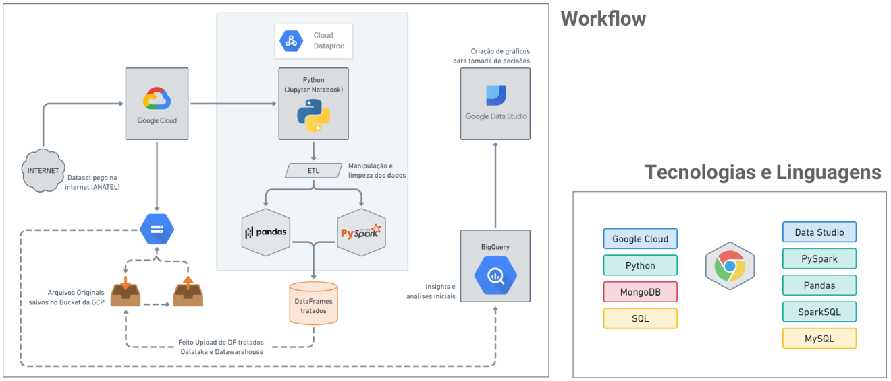

# 📡 **Telecom Data Engineering Project**

[](https://www.python.org/)
[](https://en.wikipedia.org/wiki/SQL)
[](https://cloud.google.com/)
[](https://spark.apache.org/docs/latest/api/python/)
[](https://www.mongodb.com/)
[](https://cloud.google.com/bigquery)

## 📄 **Project Overview**

This project is a **complete Data Engineering pipeline** designed to process **telecommunications data** for analysis on **mobile and fixed networks** in Brazil between **2019 and 2021**. The goal is to **transform raw data** into actionable insights using **Google Cloud Platform (GCP), SQL, PySpark, and Power BI**.

The **final output** is a dashboard created in **Google Data Studio (Looker Studio)**, presenting key insights into telecom infrastructure, 5G adoption, and user behavior trends.

---

## 🎯 **Objectives**

- **Data Collection & Storage:** Store telecom datasets in **Google Cloud Storage (GCS), MySQL, and MongoDB**.
- **Data Transformation & ETL:** Use **PySpark and Pandas** to clean and structure datasets.
- **SQL-Based Analysis:** Utilize **BigQuery** and **Spark SQL** for deep data exploration.
- **Dashboard & Visualization:** Create an **interactive report** in **Google Data Studio**.

---

## 🏗️ **ETL Workflow**

```
    A [Raw Data] -->|Upload| B(Google Cloud Storage);
    B -->|Extract| C(MySQL & MongoDB);
    C -->|Transform| D[PySpark & Pandas];
    D -->|Load| E[Data Lake & BigQuery Data Warehouse];
    E -->|Analyze| F[Google Data Studio];
```


---

## 🛠️ **Technologies Used**

- **Data Storage:**
  - Google Cloud Storage (GCS)
  - MySQL
  - MongoDB Atlas

- **ETL & Data Processing:**
  - Python (Pandas, PySpark)
  - SQL (BigQuery, Spark SQL)

- **Data Visualization:**
  - Google Data Studio (Looker Studio)

---

## 📂 **Repository Structure**

```bash
📦 Python-SQL-Projeto-de-Engenharia-de-Dados-GCP
 ┣ 📜 Projeto_Final_Telecom_-_Arquivo_Python.ipynb  # Jupyter Notebook with data processing and SQL queries for data transformation
 ┣ 📜 Apresentacao_DataStudio                       # Google Data Studio report files
 ┗ 📜 README.md                                     # Project documentation
```

---

## 🚀 **Getting Started**

### **1️⃣ Clone the Repository**
```bash
git clone https://github.com/RenanBjj/Python-SQL-Projeto-de-Engenharia-de-Dados-GCP.git
cd Python-SQL-Projeto-de-Engenharia-de-Dados-GCP
```

### **2️⃣ Set Up the Environment**
- Install dependencies:
  ```bash
  pip install pandas pyspark sqlalchemy pymongo google-cloud-bigquery
  ```
- Ensure you have access to **Google Cloud Platform (GCP)** and **BigQuery**.

### **3️⃣ Run the ETL Pipeline**
- Execute the **Jupyter Notebook**:
  ```bash
  jupyter notebook Projeto_Final_Telecom_-_Arquivo_Python.ipynb
  ```
- Run **SQL transformations** in **BigQuery**:
  ```sql
  SELECT * FROM telecom_data WHERE year >= 2019;
  ```

---

## 📊 **Key Insights from the Analysis**

- **5G Adoption:** Analysis of the distribution of **5G stations (ERBs)** across Brazil.
- **Market Trends:** Tracking **telecom company performance** (Vivo, Claro, TIM, Oi).
- **Fixed vs Mobile Growth:** Comparing the adoption of **fixed vs mobile connections**.
- **Regional Disparities:** Identifying **urban vs rural** differences in network coverage.

---

## 📈 **Google Data Studio Dashboard**

This project includes dashboards built with **Google Data Studio (Looker Studio)**, displaying:

✔ Telecom coverage maps  
✔ Growth trends by company  
✔ Technology adoption (2G, 3G, 4G, 5G)  

---

## Feedback sobre o projeto:
- Foi o único projeto a ser assistido por empresas parceiras (B&PARTNERS.CO) - https://bpartners.com.br/
- Foi o projeto destaque da turma e foi feito uma apresentação para utilização como modelo para as próximas turmas.

---

## 📬 **Contact**

For questions or collaborations:

- **GitHub:** [RenanBjj](https://github.com/RenanBjj)
- **LinkedIn:** [Renan Marques Rodrigues](https://www.linkedin.com/in/renan-marques-rodrigues/)
- **Email:** [renan.marques@example.com](mailto:renanbjj88@gmail.com)

---

🚀 **Developed as a complete Data Engineering project for real-world telecom analysis.**  

If you found this project useful, give it a ⭐ on GitHub!
